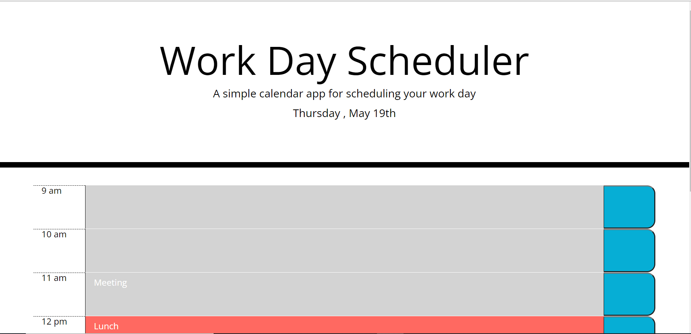
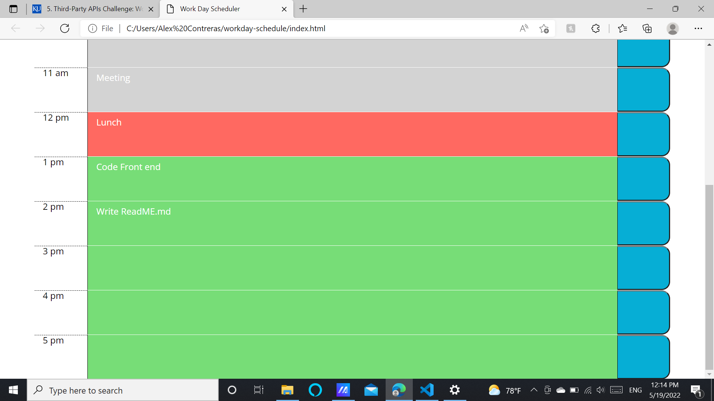

# WorkDay Scheduler

## Table of Content
### [Description](#description)
### [Links](#links)
### [Technology's Used](#technologys-used)
### [ScreenShots](#screenshots)

## Description
User will be able to plan out each hour of their workday. Users should not be afraid of there tasks disapearing because their tasks will be saved in the browers local storage. They can refresh or close and reopen the browers. Time blocks will also have a past, present, and future key.

## Links
Link to deployed application: <a href="https://alexurielcontreras.github.io/workday-schedule/">Workday Scheduler</a>
 
Link to GitHub Repo: <a href="https://github.com/AlexUrielContreras/workday-schedule">GitHub</a>

## Technolog's Used
<ul>
    <li>HTML</li>
    <li>CSS</li>
    <li>Bootstrap</li>
    <li>JavaScript</li>
    <li>jQuery</li>
</ul>

## ScreenShots

